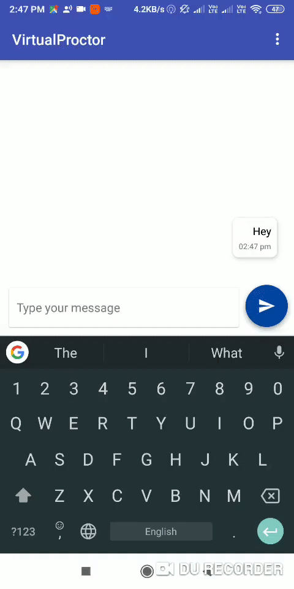

# VirtualProctor 

VirtualProctor is a futuristic way for communication between parents and teachers.

### Problem with the existing system
  1. A teacher has to answer to all the parent's queries. Eg. if there is an event in college and parents wants to know about the security details of the same, then most of the parents will ask the class teacher this question via email or personal message. In such scenerio the class teacher has to manually answer the same question to all parents.  
  2. Also the parent has to wait for the teacher to answer. Like if the teacher is busy, then the parent has to wait until the teacher checks his message and replies.

Our solution tries to solve this 2 problems.

### Our Solution
1. Instead of directly interacting with the teacher, a parent can ask their queries to a Chatbot. This chatbot will be trained in such a way that it could answer most frequently asked question.
2. A parent can also ask the chatbot for their student's result. Not just that, the parent can even ask the chatbot to compare the students performance in previous all exams.
3. Apart from this, a parent can even track the attendence of his/her ward using this chatbot.
4. If a parent is not satisfied with the chatbots answers and wishes to talk to teacher directly, then all the parent has to do is just ask the chatbot to contact the teacher. The chabot will seamlessly redirect you to a personal chat window, where parents can have personal converstion with the respective teacher.
5. This app also has an amazing notifcation module where the admin/principal can broadcast a message to each and every parent. Not just that, a teacher can also send a notification to all parents whose children study in a particular class.

### Android App Demo

<h3><a href="https://www.facebook.com/Briefly-350014818823728/">  Briefly On Messenger   </a></h3>
 

### Tech

VirtualProctor uses a number of projects to work properly:

* [Dialogflow](https://dialogflow.com/) 
* [Flask](http://flask.pocoo.org/)
* [Android](https://www.android.com/)

And of course VitualProctor itself is open source with a [public repository](https://github.com/murtaza98/VirtualProctor)
 on GitHub.

### Installation

1. clone with all submodules
`git clone --recurse-submodules https://github.com/murtaza98/VirtualProctor.git`

Then,

For VirtualProctor Server-side installation go [here](https://github.com/padfoot18/VirtualProctor_server)

For VirtualProctor Client-side(Android app) install go [here](https://github.com/ojasskapre/VirtualProctor_Android)

### Contributers

1. Murtaza Patrawala -- [@murtaza98](https://github.com/murtaza98)
2. Harsh Patel -- [@harshpatel23](https://github.com/harshpatel23)
3. Tanay Raul -- [@padfoot18](https://github.com/padfoot18)
4. Ojas Kapre -- [@ojasskapre](http://github.com/ojasskapre)

### Recognition
    - Winner of Unscript 2k19 Hackathon

### Development

Want to contribute? Great!
Please read [CONTRIBUTING.md](https://github.com/murtaza98/VirtualProctor/blob/master/CONTRIBUTING.md) for details on our code of conduct, and the process for submitting pull requests to us.

### Todos

 - 

### License
This project is licensed under the MIT License - see the [LICENSE.md](https://github.com/murtaza98/VirtualProctor/blob/master/LICENSE) file for details

### Note 
This project was done under 24 hours with minimal pre-preparation.

